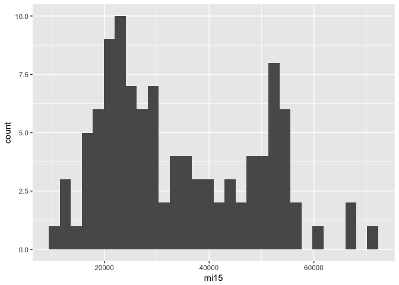

Lab 01 Notebook
================
Christopher Prener, Ph.D.
(January 31, 2018)

Introduction
------------

This is the replication notebook for Lab-01 from the course SOC 4650/5650: Introduction to GISc.

Project Set Up
--------------

``` r
knitr::opts_knit$set(root.dir = here::here())
```

Load Dependencies
-----------------

The following code loads the package dependencies for our analysis:

``` r
library(ggplot2) # creating plots
```

Load Data
---------

The following code loads the data package and assigns our data to a data frame in our global environment:

``` r
library(stlData) # data source
medianInc <- stlIncome
```

Part 1
------

### Question 10

The first question in this assignment asks for a histogram of the `pctElevated` variable.

``` r
ggplot() +
  geom_histogram(medianInc, mapping = aes(mi15))
```

    ## `stat_bin()` using `bins = 30`. Pick better value with `binwidth`.



### Question 11

Next, we want to save our plot using the `ggsave()` function:

``` r
ggsave("results/incomeHistogram.png")
```

    ## Saving 7 x 5 in image

    ## `stat_bin()` using `bins = 30`. Pick better value with `binwidth`.
